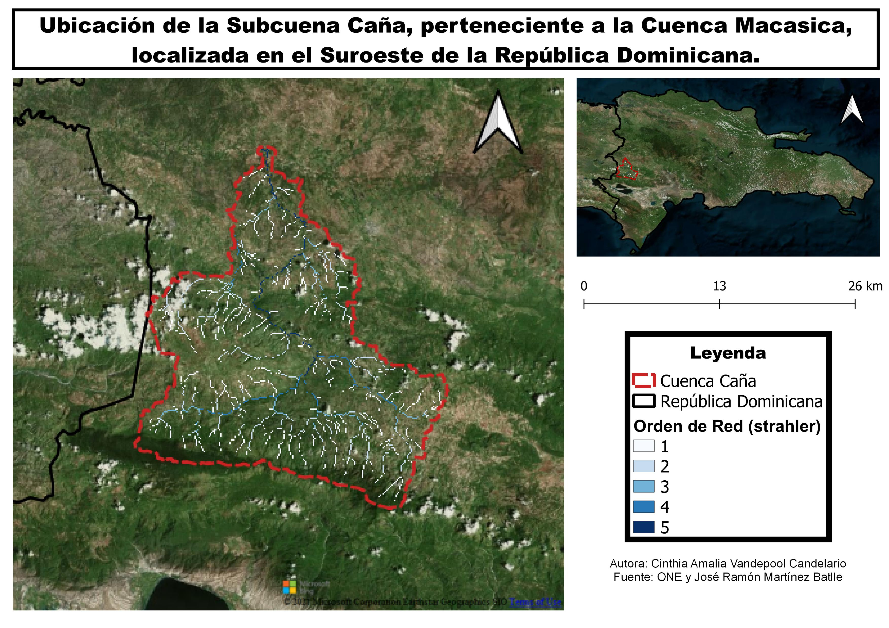
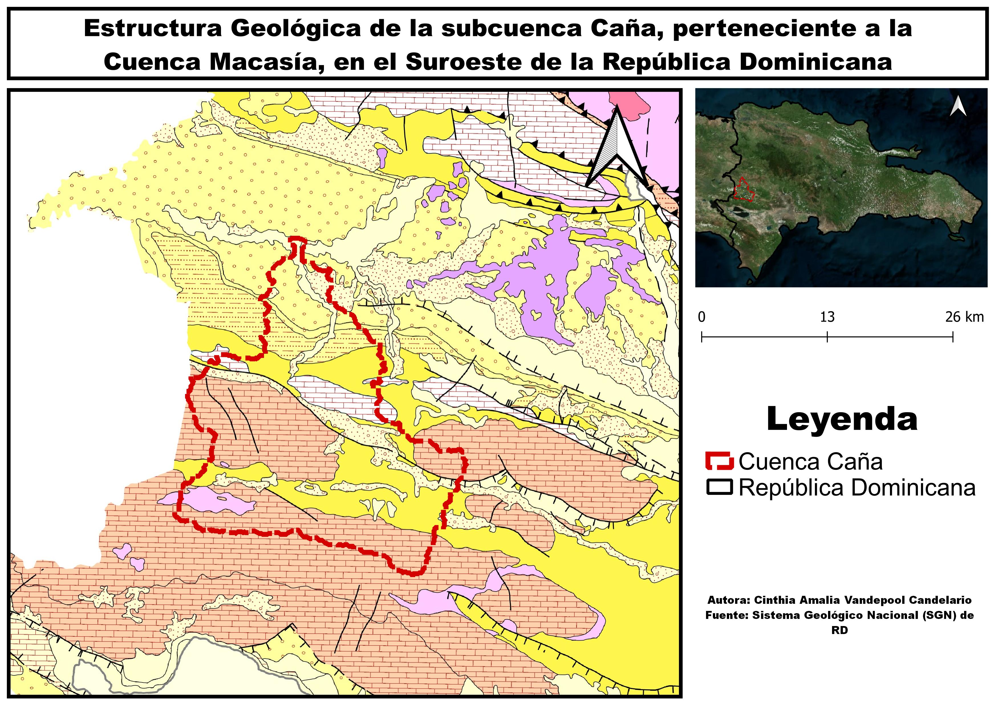
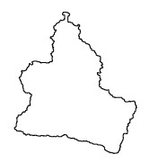
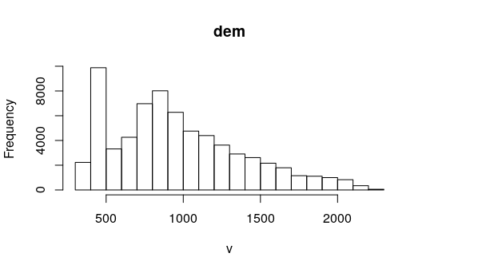

# Introducción
A lo largo del último siglo se ha reducido la dificultad para realizar analisis espaciales gracias a los novedosos avances tecnologicos, el desarrollo de los Sistemas de Información Geografica (SIG) ha simplificado el arduo trabajo que suponia llevar acabo analisis espaciales, aunque a pesar de todas las herramientas {} disponibles la República Dominicana aún está pasos por detras de muchos paises en especial en lo relacionado a los analisis morfometricos de cuencas hidrograficas, situación lamentable ya que la isla posee innumerables cursos de agua permitiéndole ocupar un lugar privilegiado en este siglo, ya que cada día, más país sufren por la escases de agua dulce potable. 

La cuenca hidrográfica a analizar en esta investigación es la Microcuenca Caña, perteneciente a la Subcuenca del Rio Macasía, ubicada en el extremo suroeste de la República Dominicana, dicho análisis se realizará basandonos en datos preexistentes a partir de un *modelo digital de elevación (DEM)*, el cual es un modelo simbólico, de estructura numérica y digital que pretende representar la distribución espacial de la elevación del terreno, siendo la altura una variable escalar que se distribuye en un espacio bi-dimensional (@burgos2014modelos).

La morfometría fluvial se encarga de analizar los parámetros morfometricos de una cuenca hidrográfica, tales como, la red de drenaje, la pendiente, la forma, el orden de la red y demás aspectos fisicos.(@) Entendiendo que la cuenca hidrográfica es ese sistema o unidad geográfica e hidrológica formada por un rio principal y todo el territorio entre el origen del rio y su desembocadura, interactúando en este espacio diversos factores bióticos y abióticos. 

El aspecto general de una cuenca se entiende como la forma en la que se distribuyen los cursos de agua, esta forma depende princiapalmente de la gravedad y la pendiente. Diversos autores ha establecido metodos tanto cualitativos como cuantitativos para determinar la forma de la cuenca, ademas de que han establecido clasificaciones para denominar a las cuencas con formas similares (ej: Dendrítica); Cuando nos referimos a la red de drenaje de una cuenca estamos refiriendonos a la relacion entre la logitud total de los cursos fluviales de todos los ordenes y el área de la cuenca, esta variable nos permitira establecer las caracteristicas litologicas del área de estudio (@GutierrezElorza).

Además, debemos tomar en cuenta, que el orden de red de los cursos de una cuenca indica el grado de ramificacion de la red fluvial; existen distintos metodos para jerarquizar los cursos de una red pero los dos más conocidos y utilizados son el metodo de Strahler (1952) y el de Horton (1945), gracias a esta jerarquización se puede entender mejor el comportamiento del sistema de drenaje de la cuenca, ademas de que se puede obtener la razon de bifurcación descrita por Horton como la relación entre el número de cursos de un orden y número de cursos de orden más alto, esta propiedad es condicionada por la forma que presenta la cuenca (@GutierrezElorza @lux2016conceptos @ibanez2011morfologia).

Gutierrez-Elorza (2008), sostiene que el perfil longitudinal de una rio es la linea obtenida a partir de las diferecias de alturas desde su afloramiento hasta desembocar en otro cuerpo de agua, este perfil es cóncavoe aunque no todos los rios lo presentan de manera clara debido a afloramientos de rocas duras, actividad tectonica reciente o debido a cambios subitos del caudal (@GutierrezElorza). A partir del Indice de Concavidad observaremos si la cuenca en cuestión presenta realmente un perfil concavo y en caso de no serlo trataremos de identificar las posibles causas.

Debido a la escases de datos sobre las caracteristicas morfometricas de las cuencas de la República Dominicana esta investigación pretende aportar datos reales sobre la morfometria de la microcuenca caña con el objetivo de que puedan ser usados para realizar futuros estudios sobre el comportamiento hidrologico de la microcuenca ante eventos climaticos y sus posibles incidencias en las poblaciones asentadas en su margen.

# Metodología

##Área de Estudio
El rio caña nace en la vertiente Norte de la Sierra de Neiba aproximadamente a unos 1,400 metros sobre el nivel del mar. Respecto a su division politico-administrativa la Microcuenca del Rio Caña abarca los municipios de El Cercado y Las Matas de Farfan en la provincia de San Juan y las comunidades de El Llano, Juan Santiago y Hondo Valle de la provinica de Elias Piña. Geograficamente se localiza entre las coordenadas 18$^\circ$ 56' 25.32" N y 18$^\circ$ 37' 39.64" N latitud norte y 71$^\circ$ 27' 18.45" W y 71$^\circ$ 44' 03.63" W longitud oeste @MedioAmbiente.

{width=75%}

De acuerdo al mapa Zonas de Vida (OEA, 1967), la mayor superficie de la cuenca lo ocupa el Bosque humedo subtropical, se caracteriza por presentar topografía que varía desde plana hasta accidentada con un patrón de lluvia que varía de 1000 mm. a 2000 mm.. Según la ubicación de las áreas, la biotemperatura media anual es de 23ºC a 24ºC con una evapotranspiración potencial estimada en promedio de 20% menor que la precipitación media total anual. El Bosque muy húmedo Montano Bajo es la segunda en extensión, se caracteriza por la presencia de escarchas temporales, precipitaciones que alcanzar cantidades mayores a los 2,000 mm. totales anuales con una evapotranspiración potencial estimada en promedio de 55% menor que la precipitación media total anual, su topografía generalmente accidentada con elevaciones que van desde los 850 hasta los 2,100 metros y en menor proporcion lo ocupa el bosque humedo montano bajo @MedioAmbiente.

La mayor parte de la cuenca discurre sobre la vertiente Norted del sistema geomorfologico de la Sierra de Neiba y en menor proporción sobre el Valle de San juan, siendo la geología conformada, en mayor proporción, por Caliza tipo Neiba, Marga con calcarenita tipo sombrerito, Marga con intercalaciones de bancos de caliza arenosa, arenisca, marga arenosa, conglomerados, conglomerados poligenico, molasa marina y continental y arena; y en menor proporción está conformada por caliza en bancos de espesores variables con nodulos e intercalaciones de pedernal de color blanco-crema, depositos fluviales, depositos cuaternarios indiferenciados, Basaltos, Tobas, Aglormerados y Rocas Volcánicas Submarinas @MedioAmbiente.

{width=75%}

##Metodología
Para la elaboración de esta investigación se emplearon métodos de analisis morfometrico a partir de un DEM de la cuenca de interes, inicialmente cargué una serie de paquetes de Grass en R adecuando el entorno para ejectar los códigos necesarios.

En primer lugar, se importó a R, como SpatialGridDataFrame, un DEM alojado en la base de datos de GRASS GIS, se estableció su ruta y conviertiéndolo a su vez en un objeto raster por medio del paquete raster de R; partiendo del complemento *r.watershed* (el cual generá un conjunto de mapas que indican: *la acumulación de flujo, la dirección del drenaje, la ubicación de los arroyos y las cuencas hidrográficas* (@addonrwater)) y del modelo digital de elevaciones (DEM) se generaron diversas capas calculando así los parámetros hidrográficos de la cuenca del rio caña y sus redes de drenaje, además, seguido a esto se importó un conjunto de capas ráster de GRASS GIS a R, como el mapa de red de drenaje y el mapa de cuencas visualizandolas por medio de *leaflet*. 

Utilizando el complemento de GRASS GIS *r.water.outlet* (@addonrwateroutlet) y apoyandose en los paquetes *mapview* (@mapview) y *leaflet* se extrajó la cuenca de drenaje a partir de un mapa de dirección de flujos con un umbral de acumulación de *80 celdas* y las coordenadas de la desembocadura de la cuenca cana (-71.62524,18.94026).

Posteriormente se estableció una máscara usando el límite de la cuenca caña para luego realizar la extracción partir del DEM de la red de drenaje utilizando el complemento de GRASS GIS *r.stream.extract* (@addonrstreamextract) desde R. Tras esto, se utilizó el complemento *r.stream*(@addonrstream) para generar un mapa de dirección de flujo, *r.stream.order* (@addonrstreamorder) para un mapa de orden de red según varios métodos, entre ellos el método de Strahler y de Horton, a partir de *r.stream.basins* (@addonrstreambasins) un mapa de cuencas según órdenes de red y apoyandose del complemento *r.stream.stats*(@addonrstreamstats) se generó las estadísticas de red resumidas por órdenes, incluyendo la razón de bifurcación.  

# Resultados
A partir de los codigos ejectudos determinamos que la microcuenca del rio caña posee una superficie de 525 km\textsuperscript{2} con un perimetro de 139 km, presentando una forma similiar a la de un triagulo, presenta mayor extension en el Sur reduciendo su extension asi el Norte. 

{width=30%}

Esta microcuenca posee una elevacion maxima de 2,231 metros sobre el nivel del mar, una elevacion minima de 330 metros sobre el nivel del mar y una elevacion media de 958 metros. Ademas presenta una pendidente de 10.56. 

{width=50%}

# Discusión

# Agradecimientos

# Información de soporte

\ldots

# *Script* reproducible

\ldots

# Referencias
