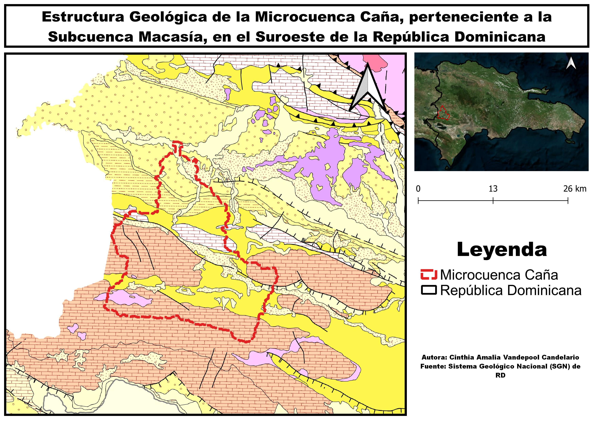

# Introducción
A lo largo del último siglo se ha reducido la dificultad para realizar análisis espaciales gracias a los novedosos avances tecnológicos, el desarrollo de los Sistemas de Información Geográfica (SIG) ha simplificado el arduo trabajo que suponía llevar acabo análisis espaciales, aunque a pesar de todas las herramientas disponibles la República Dominicana aún está pasos por detrás de muchos países en especial en lo relacionado a los análisis de morfometría fluvial, situación lamentable ya que la isla posee innumerables cursos fluviales permitiéndole ocupar un lugar privilegiado en este siglo, ya que, cada día más país sufren por la escases de agua dulce potable. 

La cuenca hidrográfica a analizar en esta investigación es la Microcuenca Caña, perteneciente a la Subcuenca del Rio Macasía, ubicada en el extremo suroeste de la República Dominicana, dicho análisis se realizará basándonos en datos preexistentes a partir de un *modelo digital de elevación (MDE)*, el cual es un modelo simbólico, de estructura numérica y digital que pretende representar la distribución espacial de la elevación del terreno, siendo la altura una variable escalar que se distribuye en un espacio bi-dimensional (@burgos2014modelos).

La morfometría fluvial se encarga de analizar los parámetros morfométricos de una cuenca hidrográfica, tales como, la red de drenaje, la pendiente, la forma, el orden de la red y demás aspectos físicos. Entendiendo que la cuenca hidrográfica es ese sistema o unidad geográfica e hidrológica formada por un rio principal y todo el territorio entre el origen del rio y su desembocadura, interactuando en este espacio diversos factores bióticos y abióticos. 

El aspecto general de una cuenca se entiende como la forma en la que se distribuyen los cursos de agua, esta forma depende principalmente de la gravedad y la pendiente. Diversos autores ha establecido métodos tanto cualitativos como cuantitativos para determinar la forma de la cuenca, además de que han establecido clasificaciones para denominar a las cuencas con formas similares (ej: Dendrítica); Cuando nos referimos a la red de drenaje de una cuenca estamos refiriéndonos a la relación entre la longitud total de los cursos fluviales de todos los órdenes y el área de la cuenca, esta variable nos permitirá establecer las características litológicas del área de estudio (@GutierrezElorza).

Además, debemos tomar en cuenta, que el orden de red de los cursos de una cuenca indica el grado de ramificación de la red fluvial; existen distintos métodos para jerarquizar los cursos de una red pero los dos más conocidos y utilizados son el método de Strahler (1952) y el de Horton (1945), gracias a esta jerarquización se puede entender mejor el comportamiento del sistema de drenaje de la cuenca, además de que se puede obtener la razón de bifurcación descrita por Horton como la relación entre el número de cursos de un orden y número de cursos de orden más alto, esta propiedad es condicionada por la forma que presenta la cuenca (@GutierrezElorza @lux2016conceptos @ibanez2011morfologia).

Gutierrez-Elorza (2008), sostiene que el perfil longitudinal de una rio es la línea obtenida a partir de las diferencias de alturas desde su afloramiento hasta desembocar en otro cuerpo de agua, este perfil es cóncavo, aunque no todos los ríos lo presentan de manera clara debido a afloramientos de rocas duras, actividad tectónica reciente o debido a cambios súbitos del caudal (@GutierrezElorza). A partir del Índice de Concavidad observaremos si la cuenca en cuestión presenta realmente un perfil cóncavo, en caso de no serlo trataremos de identificar las posibles causas y determinar si existe evidencia de una posible reorganización de la red de drenaje.

Debido a la escases de datos sobre las características morfométricas de las cuencas de la República Dominicana esta investigación pretende aportar datos reales sobre la morfométria de la microcuenca caña con el objetivo de que puedan ser usados para realizar futuros estudios sobre el comportamiento hidrológico de la microcuenca ante eventos climáticos y sus posibles incidencias en las poblaciones asentadas en su margen.

# Metodología

##Área de Estudio
El rio caña nace en la vertiente Norte de la Sierra de Neiba aproximadamente a unos 1,400 metros sobre el nivel del mar. Respecto a su división político-administrativa la Microcuenca del Rio Caña abarca los municipios de El Cercado y Las Matas de Farfán en la provincia de San Juan y las comunidades de El Llano, Juan Santiago y Hondo Valle de la provincia de Elías Piña. Geográficamente se localiza entre las coordenadas 18$^\circ$ 56' 25.32" N y 18$^\circ$ 37' 39.64" N latitud norte y 71$^\circ$ 27' 18.45" W y 71$^\circ$ 44' 03.63" W longitud oeste (@MedioAmbiente) (figura\ref{mapacuenca}). 

{width=75%}

De acuerdo al mapa Zonas de Vida (OEA, 1967), la mayor superficie de la cuenca lo ocupa el Bosque húmedo subtropical, se caracteriza por presentar topografía que varía desde plana hasta accidentada con un patrón de lluvia que varía de 1000 mm. a 2000 mm. Según la ubicación de las áreas, la biotemperatura media anual es de 23ºC a 24ºC con una evapotranspiración potencial estimada en promedio de 20% menor que la precipitación media total anual. El Bosque muy húmedo Montano Bajo es la segunda en extensión, se caracteriza por la presencia de escarchas temporales, precipitaciones que alcanzar cantidades mayores a los 2,000 mm. totales anuales con una evapotranspiración potencial estimada en promedio de 55% menor que la precipitación media total anual, su topografía generalmente accidentada con elevaciones que van desde los 850 hasta los 2,100 metros y en menor proporción lo ocupa el bosque húmedo montano bajo (@MedioAmbiente).

La mayor parte de la cuenca discurre sobre la vertiente Norte del sistema geomorfológico de la Sierra de Neiba y en menor proporción sobre el Valle de San juan, siendo la geología conformada, en mayor proporción, por Caliza tipo Neiba, Marga con calcarenita tipo sombrerito, Marga con intercalaciones de bancos de caliza arenosa, arenisca, marga arenosa, conglomerados, conglomerados poligenico, molasa marina y continental y arena; y en menor proporción está conformada por caliza en bancos de espesores variables con nódulos e intercalaciones de pedernal de color blanco-crema, depósitos fluviales, depósitos cuaternarios indiferenciados, Basaltos, Tobas, Aglomerados y Rocas Volcánicas Submarinas (@MedioAmbiente) (Ver figura\ref{mapageologico})

{width=75%}

##Metodología
Para la elaboración de esta investigación se emplearon métodos de análisis morfométrico a partir de un MDE de la cuenca de interés, inicialmente cargué una serie de paquetes de Grass en R adecuando el entorno para ejecutar los códigos necesarios.

En primer lugar, se importó a R, como SpatialGridDataFrame, un MDE alojado en la base de datos de GRASS GIS, se estableció su ruta y convirtiéndolo a su vez en un objeto raster por medio del paquete raster de R; partiendo del complemento *r.watershed* (el cual genera un conjunto de mapas que indican: *la acumulación de flujo, la dirección del drenaje, la ubicación de los arroyos y las cuencas hidrográficas* (@addonrwater)) y del MDE se generaron diversas capas calculando así los parámetros hidrográficos de la cuenca del rio caña y sus redes de drenaje, además, seguido a esto se importó un conjunto de capas ráster de GRASS GIS a R, como el mapa de red de drenaje y el mapa de cuencas visualizándolas por medio de *leaflet*. 

Utilizando el complemento de GRASS GIS *r.water.outlet* (@addonrwateroutlet) y apoyándose en los paquetes *mapview* (@mapview) y *leaflet* se extrajo la cuenca de drenaje a partir de un mapa de dirección de flujos con un umbral de acumulación de *80 celdas* y las coordenadas de la desembocadura de la cuenca cana (-71.62524,18.94026).

Posteriormente se estableció una máscara usando el límite de la cuenca caña para luego realizar la extracción partir del MDE de la red de drenaje utilizando el complemento de GRASS GIS *r.stream.extract* (@addonrstreamextract) desde R. Tras esto, se utilizó el complemento *r.stream*(@addonrstream) para generar un mapa de dirección de flujo, *r.stream.order* (@addonrstreamorder) para un mapa de orden de red según varios métodos, entre ellos el método de Strahler y de Horton, a partir de *r.stream.basins* (@addonrstreambasins) un mapa de cuencas según órdenes de red y apoyándose del complemento *r.stream.stats*(@addonrstreamstats) se generó las estadísticas de red resumidas por órdenes, incluyendo la razón de bifurcación.  

También obtuvimos el curso más largo de la microcuenca a partir de la función creada por José Ramón Martínez *LfpNetwork*, además con la misma función pudimos obtener los cursos más largos de las cuencas tributarias. Seguido generamos los perfiles longitudinales de la microcuenca y calculamos sus índices de concavidad y a partir de las herramientas *QGIS* y *Google EARTH* cruzamos la información geológica con los patrones de concavidad/convexidad. 

Luego utilizamos *r.basin* para determinar los parámetros morfométricos de la microcuenca en estudio, tales como el área de la microcuenca, su perímetro, la pendiente, los órdenes de red, entre otros. Y por últimos, utilizamos mapas de la microcuenca y el MDE para crear curvas hipsométricas y calcular la integral hipsométrica utilizando la función *HypsoIntCurve* creada por José Ramón Martínez.

# Resultados
##Delimitación y Forma de la Microcuenca
A partir de los códigos ejecutados determinamos que la microcuenca del rio caña posee una superficie de 525 km\textsuperscript{2} con un perímetro de 139 km, presentando una forma similar a la de un triángulo, presenta mayor extensión en el Sur reduciendo su extensión así el Norte. (figura\ref{areacuenca})

{width=30%}

##Datos de Elevación
Esta microcuenca posee una elevación máxima de 2,231 metros sobre el nivel del mar, una elevación mínima de 330 metros sobre el nivel del mar y una elevación media de 958 metros. Además, presenta una pendiente de 10.56 (figura\ref{pendiente} figura\ref{mapadependiente}).

{width=50%}

{width=50%}

##Red de Drenaje, Orden de Red y Razón de Bifurcación
Partiendo del complemento *r.stream* se generó la red de drenaje de la microcuenca caña y utilizando el método de Strahler se determinó el orden de red siendo el orden máximo de 5. En total la cuenca tiene 271 cursos de fluviales y una densidad de drenaje de 0.84 km/km\textsuperscript{2} (figura\ref{reddrenaje}).   

{width=57%}

| Orden de Red | No. de Cursos fluviales |
|:------------:|:-----------------------:|
|       1      |           204           |
|       2      |            50           |
|       3      |            12           |
|       4      |            4            |
|       5      |            1            |

A continuación, se indicarán la razón de bifurcación de todos los órdenes de red de la microcuenca caña, utilizando dos procedimientos distintos:

La razón de bifurcación promedio del par de ordenes 1|2 es 204/50=4.08, para el par de ordenes 2|3 es 50/12=4.16, para el par de ordenes 3|4 es 12/4=3 y para el par de ordenes 4|5 es 4/1=4; el valor promedio es Rb= 3.811667. Mientras la razón de bifurcación por medio de coeficientes de regresión es Rb= 3.7292 (figura\ref{razonbifurcacion}).

{widht=50} 

###Perfiles Longitudinales e Índices de Concavidad
EL curso más largo discurre por el lado occidental de la cuenca y posee una longitud de 58.1 Kilometros (figura\ref{cursolargo}).

{widht=25%}

Según los resultados obtenidos, en su mayoria los cursos de la microcuenca presentan un perfil concavo y en pocas ocasiones pesenta un perfil convexo pudiendo deberese esto a estar en zona de cabecera o por discurrir sobre depositos aluviales; además, algunos flujos presentan un perfil rectilino que puede deberse al tipo de material por el que discurre. 

{widht=75%}

{widht=100%}

# Discusión
Gracias a las investigaciones y observaciones realizadas pudimos obtener las características morfometricas de la microcuenca caña; Pudimos determina que las características morfometricas de la microcuenca caña presentan un patrón de drenaje detrítico, que según @GutierrezElorza se debe a la interacción entre el flujo y los materiales erosionables. 

También, superponiendo la red de drenaje sobre el mapa geológico nacional, pudimos observar que existen la posibilidad de un proceso de reorganizamiendo del drenaje, aunque se requieren más estudios; además creemos que el curso principal paso por un proceso de migración lateral, aunque también se tendría que estudiar la evolución de la microcuenca.

Con relación a la razón de bifurcación, según Horton (1945) esta razón debe ser constante entre un par de órdenes y el otro pero en la microcuenca de estudio esto no sucede aunque estas variaciones sean mínimas se requerirán estudios más profundos para determinar si es debido a las variaciones climáticas o litológicas. Además obtuvimos valores distintos cuando calculamos la razón de bifurcación promedio y la razón de bifurcación por medio de coeficientes de regresión aunque la diferencia fue de apenas 0.08. 

Como consecuencia de los hallazgos de esta investigación pudimos determinar los parámetros morfométricos de esta microcuenca, sin embargo, este trabajo solo representa la base para formular nuevas hipótesis que requerirán nuevas investigaciones, no solo de esta Microcuenca sino también en todos los sistemas fluviales de la isla ya que este tipo de estudios son escasos o inexistentes.

# Agradecimientos

# Información de soporte

\ldots

# *Script* reproducible

\ldots

# Referencias
